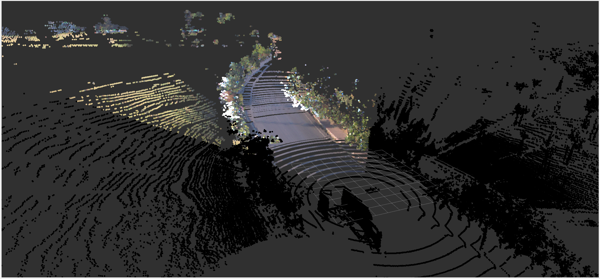
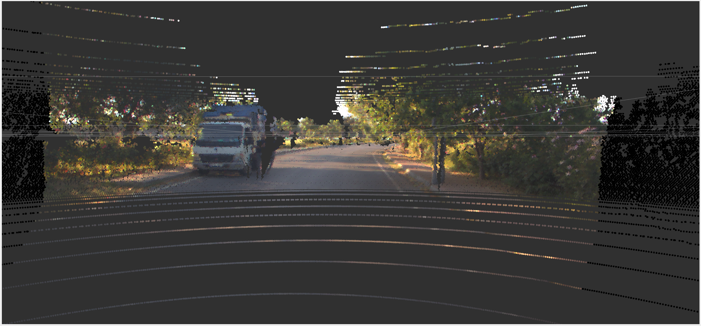
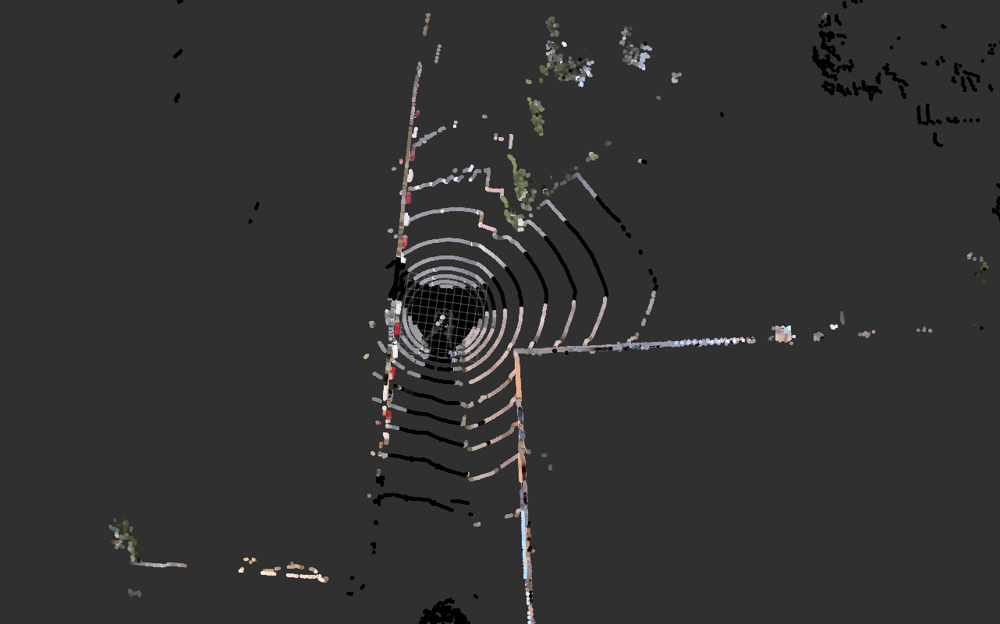
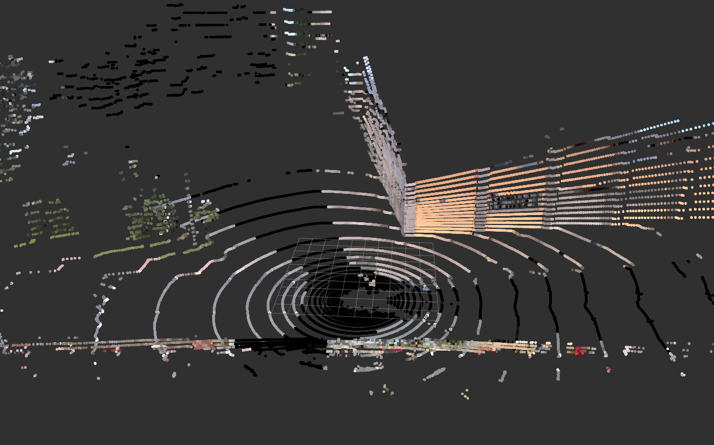
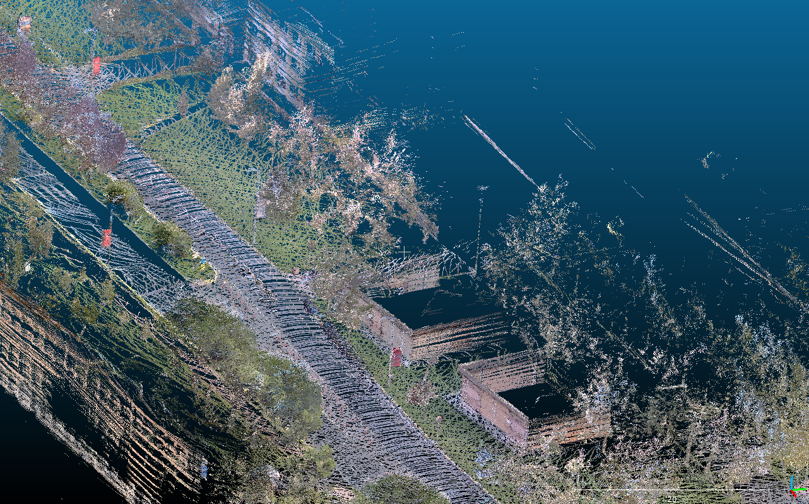

# color-point-cloud

Tool for colorize point cloud with images from camera. This tool takes a point cloud and
dynamic number of images from camera via ROS2 and colorize the point cloud with the images.

## Installation

### Prerequisites

- ROS2 (tested with Humble)
- OpenCV
- PCL
- Eigen3


### Build

```bash
mkdir -p ~/color-point-cloud_ws/src
cd ~/color-point-cloud_ws/src
git clone https://github.com/leo-drive/color-point-cloud
cd ..
colcon build --symlink-install
```

## Usage

### Run

```bash
source ~/color-point-cloud_ws/install/setup.bash
ros2 launch color_point_cloud color_point_cloud.launch.xml
```

### Parameters

Change parameters in `color_point_cloud.launch.xml` to fit your environment.

| Parameter | Description                             | 
| :-------- |:----------------------------------------| 
| `point_cloud_topic` | your lidar topic as `string`            |
| `point_cloud_frame_id` | your lidar topic as `string`            |
| `camera_topics` | array of your camera topics as `string` |
| `image_type` | your image format `enum`                |

### Result

#### Projection Lucid Vision Triton 5.4 MP 120° camera onto Velodyne Alpha Prime LiDAR

<p align='center'>
    
    
</p>

#### Projection AC-IMX390 camera onto RoboSense Helios 32 beam LiDAR

<p align='center'>
    
    
</p>

#### SLAM results with LIO-SAM

<p align='center'>
    
    
</p>